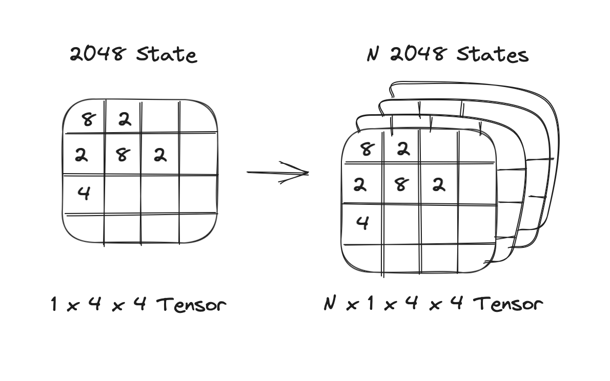
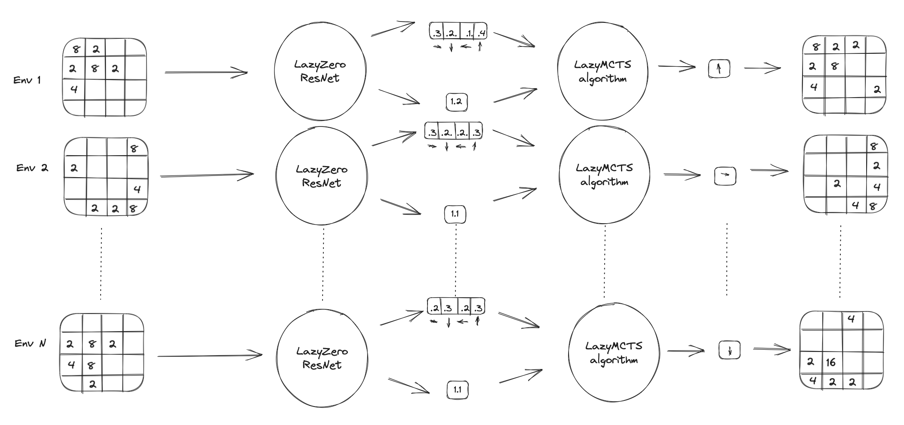
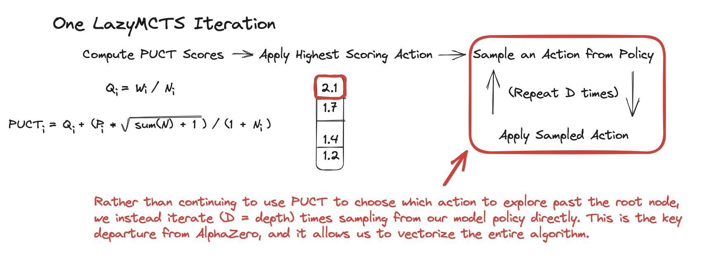

# LazyZero

LazyZero is an approximate, GPU-accelerated, vectorized implementation of DeepMind's AlphaZero reinforcement learning algorithm. AlphaZero is an algorithm that utilizes Deep Neural Networks alongside Monte Carlo Tree Search to make decisions in perfect-information games, which has since been extended to other applications, such as video compression and code generation. 

I speak a lot about AlphaZero and Monte Carlo Tree Search (MCTS) in this wiki, it would be useful to read the following atricle before jumping in if you aren't familiar with these concepts: https://web.stanford.edu/~surag/posts/alphazero.html. This article does a great job explaining the intuition behind AlphaZero and illustrating concepts with code.

One issue with AlphaZero is that it is incredibly compute-inefficient to train, oftentimes requiring hundreds of model inference calls and even more game logic calls per episode step. AlphaGo, for instance, could only be trained with thousands of TPUs. This costliness combined with the need to train on millions of episodes means that as problem complexity scales, compute requirements also scale to the point where it becomes infeasible to effectively train a model.

While efforts have been made to better parallelize AlphaZero using batch processing, there (to my knowledge) is a lack of a true vectorized approch that takes full advantage of GPU-parallelism. 

In this project I introduce __*LazyZero*__, a fully-vectorized implementation of AlphaZero that sacrifices model accuracy for dramatically better efficiency.

The LazyZero project aims to introduce a framework for fully-vectorized training of AlphaZero-esque models with the following features:
* __end-to-end GPU acceleration:__ environment logic/simulation + model training/inference all happens without data ever leaving the GPU
    * __WIP:__ the current implementation stores training examples in the Replay Memory buffer in RAM rather than on the GPU, in order to truly be GPU-accelerated end-to-end this mechanism will be moved to the GPU as well
* __a lazy, vectorized implementation of MCTS:__ rather than utilize the resource-hungry full implementation of MCTS, we utilize a lazy version that identifies branches to explore during each iteration using PUCT at the root node, then samples from the learned policy to carry out fixed-depth rollouts. This approach is completely vectorizable and can be carried out across thousands of environments at once. 
    * While this approach ultimately only trains an approximation of a true-alphazero policy, it is many magnitudes more efficient to train, and I hope to prove it yields a *close* approximation of the non-lazy policy. In compute-constrained environments, LazyZero could provide a viable alternative where AlphaZero is infeasible.
    * *__Key Idea: The learned policy is algorithm-agnostic, which means production environments could still utilize full-MCTS while using the lazily-trained policy__*
* __a gymnasium-esque framework for defining vectorized environments:__ we define base classes for vectorized environments that closely resemble the gymnasium environment spec. 
    * we currently implement an environment for stochastic, single-player games. Future work will implement the traditional multi-agent environment as well
    * Future work may also include a migration to be gymnasium-compatible
* __toy examples__: Train a model with LazyZero to play and win *2048*. Play hundreds of thousands of games in parallel on a single GPU! I'm working on expanding this to multi-player games as well.

While LazyZero shows promise, it is still just a hypothesis rather than a proven framework. While environments like *2048* are vectorizable, it is unclear whether that holds true across more sophisticated, interesting use-cases. In addition, further testing and research is necessary to determine whether or not LazyZero provides a good-enough approximation of true AlphaZero to merit use. *There is much work to be done to answer these questions.*

If you'd like to collaborate on these ideas with me, please reach out! 

## Implementation Details
### VectEnv
In order to take advantage of GPU parallelism, environments must be implemented as a stacked set of states that operations can be applied to in parallel. In the case of *2048* this looks something like this:


This representation allows us to perform model inference on many environments at once, which is a big improvement on other open-source implementations of AlphaZero. But perhaps of even greater significance, this representation allows us to vectorize operations on environment states. LazyZero follows a very simple workflow while collecting episodes during training:


We use a similar workflow within LazyMCTS to explore subsequent game states.

In AlphaZero implementations, you usually see something more akin to this:


While many implementations mitigate this obvious downside with cpu-based parallelism (multi-processing) alongside clever batching, these methods fail to capture the dramatic performance upside of doing everything on the GPU.

A key drawback of LazyMCTS is that environments *must* be vectorized. If implementation details or charistertics of an environment make it impossible or inefficient to vectorize, LazyMCTS will not provide any meaningful throughput improvement over CPU-based parallelism. A nice property of *2048* is that all necessary computation can be written as a set of matrix operations, which means that we can vectorize these operations and apply them to every state at once. I'll illustrate with a few examples:

In 2048, the possible actions in any given state are sliding Up, Down, Left, and Right. A slide action is legal if any tile can slide in the given direction, or if two similar tiles slide into one another and combine. We can use the following operations to check the legality of each action for a given state. In this example (and in the environment I implemented), I use powers of 2 (e.g. 8-tile = 3, 2048-tile = 11) to represent the game tiles. I use '0' to denote an empty grid space.


We also need to check for the case where identical-tiles merge, for this example I'll just show the code:

```python
# Compute the differences between adjacent elements in the 2nd and 3rd dimensions
vertical_diff = states[:, :, :-1, :] - states[:, :, 1:, :]
horizontal_diff = states[:, :, :, :-1] - states[:, :, :, 1:]

# Check where the differences are zero, excluding the zero elements in the original matrix
vertical_zeros = torch.logical_and(vertical_diff == 0, states[:, :, 1:, :] != 0)
horizontal_zeros = torch.logical_and(horizontal_diff == 0, states[:, :, :, 1:] != 0)
```

Notice that in this example code we are operating on 4 dimensions, because these are vectorized operations across many 1x4x4 environments. With some help from our GPU we can simulataneously compute the legal actions across N boards!

All LazyZero environments inherit from the VectEnv base class. Much like gymnasium, this class implements step(action) and reset():

However, certain details make this implementation incompatible with other aspects of gymnasium, so for the time being these environments are not compatible with gymnasium tooling.

### LazyMCTS
LazyMCTS approximates true Monte Carlo Tree Search by performing MCTS-esque exploration/exploitation decisions at the root node only, and then carrying out fixed-depth rollouts sampling from the current trained policy. Maintining W and N values at the root node is trivial and easily vectorizable, but maintining these values for a dynamically expanding tree structure is infeasible to vectorize, so LazyMCTS performs fixed-depth rollouts sampling from the model policy instead.



With a vectorized environment and a vectorized search algorithm, we can perform an episode step using LazyMCTS across many environments all at once, without data ever leaving the GPU. We can take this further and perform entire training or evaluation episodes entirely on the GPU. 

This leads into the issue of storing training examples in the Replay Memory Buffer, a key component of AlphaZero.


## Results
I've been using the toy environment *2048* to iterate and improve upon the vectorized implementation of MCTS. I'm planning on implementing more sophisticated environments for single-player and multi-player games very soon.

After training for a 6 epochs (600,000 episodes), LazyZero demonstrated the ability to reliably score the 2048 tile or higher.


However, it is important to notice that as iteration depth increased 


## Planned Features
* support for multi-player environments
* cpu-parallelism for training in non-GPU computing environments using multiprocessing
* implement full-MCTS for production environments
* GPU replay memory buffer